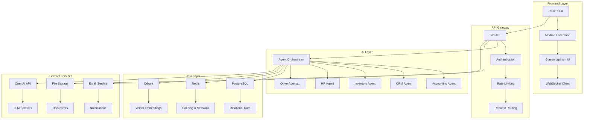

# FusionAI Enterprise Suite - System Design

## Overview

FusionAI Enterprise Suite is an AI-driven, modular ERP platform built with modern technologies and designed for scalability, maintainability, and extensibility. The system follows a microservices architecture with AI integration at every layer.

## Architecture Principles

### 1. Modular Design
- **Module Independence**: Each ERP module operates independently with its own data, logic, and AI agents
- **Plugin Architecture**: New modules can be added without affecting existing functionality
- **Lazy Loading**: Modules are loaded on-demand to improve performance

### 2. AI-First Approach
- **Multi-Agent System**: Specialized AI agents for each module and business function
- **Intelligent Orchestration**: Central orchestrator routes requests to appropriate agents
- **Continuous Learning**: Agents learn from user interactions and improve over time

### 3. Modern Tech Stack
- **Frontend**: React 18 with TypeScript, Vite, Tailwind CSS, Framer Motion
- **Backend**: FastAPI with Python 3.11+, SQLAlchemy, Redis, Qdrant
- **AI/ML**: LangChain, OpenAI/Anthropic, Sentence Transformers
- **Infrastructure**: Docker, Kubernetes, PostgreSQL, Redis, Qdrant

## System Architecture



## Component Design

### Frontend Architecture

#### 1. Component Hierarchy
```
App
├── ThemeProvider
├── AuthProvider
├── WebSocketProvider
└── MainLayout
    ├── Sidebar
    ├── Header
    └── PageContent
        ├── Dashboard
        ├── ModulePages
        └── AIChat
```

#### 2. State Management
- **Zustand**: Global state management
- **TanStack Query**: Server state and caching
- **React Context**: Theme and authentication state

#### 3. UI Design System
- **Glassmorphism**: Frosted glass effects with purple gradient theme
- **Responsive Design**: Mobile-first approach with breakpoints
- **Accessibility**: WCAG 2.1 AA compliance
- **Animation**: Framer Motion for smooth transitions

### Backend Architecture

#### 1. API Structure
```
FastAPI Application
├── Core Services
│   ├── Database (SQLAlchemy)
│   ├── Redis (Caching)
│   ├── Qdrant (Vector DB)
│   └── WebSocket
├── AI Agents
│   ├── Orchestrator
│   ├── Specialized Agents
│   └── Vector Store
└── API Endpoints
    ├── Authentication
    ├── Modules
    ├── AI Chat
    └── Dashboard
```

#### 2. Database Design
- **PostgreSQL**: Primary relational database
- **Redis**: Caching, sessions, and rate limiting
- **Qdrant**: Vector database for AI embeddings and search

#### 3. AI Agent System
- **Base Agent**: Common functionality for all agents
- **Specialized Agents**: Module-specific AI capabilities
- **Orchestrator**: Routes requests and coordinates agents
- **Vector Store**: Manages embeddings and semantic search

## Data Flow

### 1. User Request Flow
```
User Input → Frontend → API Gateway → Agent Orchestrator → Specialized Agent → Database → Response
```

### 2. AI Processing Flow
```
User Query → Intent Analysis → Agent Selection → Context Retrieval → LLM Processing → Action Execution → Response
```

### 3. Real-time Updates
```
Database Change → WebSocket → Frontend Update → UI Refresh
```

## Security Design

### 1. Authentication & Authorization
- **JWT Tokens**: Stateless authentication
- **Role-Based Access**: Granular permissions per module
- **API Keys**: For external integrations

### 2. Data Protection
- **Encryption at Rest**: Database encryption
- **Encryption in Transit**: HTTPS/TLS
- **Input Validation**: Pydantic models
- **SQL Injection Prevention**: SQLAlchemy ORM

### 3. AI Security
- **Prompt Injection Protection**: Input sanitization
- **Rate Limiting**: Prevent abuse
- **Audit Logging**: Track all AI decisions
- **Human Oversight**: Approval workflows for critical decisions

## Performance Design

### 1. Frontend Optimization
- **Code Splitting**: Lazy loading of modules
- **Caching**: Aggressive caching with TanStack Query
- **Bundle Optimization**: Tree shaking and minification
- **CDN**: Static asset delivery

### 2. Backend Optimization
- **Database Indexing**: Optimized queries
- **Connection Pooling**: Efficient database connections
- **Caching Strategy**: Multi-layer caching
- **Async Processing**: Non-blocking operations

### 3. AI Optimization
- **Model Caching**: Cache frequently used models
- **Batch Processing**: Process multiple requests together
- **Vector Indexing**: Optimized similarity search
- **Response Streaming**: Real-time AI responses

## Scalability Design

### 1. Horizontal Scaling
- **Microservices**: Independent scaling of components
- **Load Balancing**: Distribute traffic across instances
- **Database Sharding**: Partition data across multiple databases
- **CDN**: Global content delivery

### 2. Vertical Scaling
- **Resource Optimization**: Efficient memory and CPU usage
- **Database Tuning**: Optimized queries and indexes
- **Caching Layers**: Reduce database load
- **Background Processing**: Offload heavy tasks

### 3. AI Scaling
- **Agent Pooling**: Multiple agent instances
- **Model Serving**: Dedicated model serving infrastructure
- **Vector Clustering**: Distributed vector search
- **Batch Processing**: Efficient bulk operations

## Monitoring & Observability

### 1. Logging
- **Structured Logging**: JSON format with correlation IDs
- **Log Levels**: DEBUG, INFO, WARNING, ERROR, CRITICAL
- **Centralized Logging**: ELK stack or similar

### 2. Metrics
- **Application Metrics**: Custom business metrics
- **System Metrics**: CPU, memory, disk, network
- **AI Metrics**: Agent performance, model accuracy
- **User Metrics**: Usage patterns and behavior

### 3. Tracing
- **Distributed Tracing**: Track requests across services
- **Performance Monitoring**: Identify bottlenecks
- **Error Tracking**: Automatic error detection and alerting

## Deployment Architecture

### 1. Development Environment
- **Docker Compose**: Local development setup
- **Hot Reloading**: Fast development iteration
- **Mock Services**: Simulated external dependencies

### 2. Staging Environment
- **Production-like**: Mirrors production configuration
- **Integration Testing**: End-to-end testing
- **Performance Testing**: Load and stress testing

### 3. Production Environment
- **Kubernetes**: Container orchestration
- **High Availability**: Multi-region deployment
- **Auto-scaling**: Dynamic resource allocation
- **Blue-Green Deployment**: Zero-downtime updates

## Future Enhancements

### 1. Advanced AI Features
- **Multi-modal AI**: Text, image, and voice processing
- **Reinforcement Learning**: Self-improving agents
- **Federated Learning**: Privacy-preserving model training
- **Edge AI**: On-device AI processing

### 2. Platform Extensions
- **Mobile Apps**: Native iOS and Android apps
- **API Marketplace**: Third-party integrations
- **White-label Solution**: Customizable branding
- **Multi-tenancy**: SaaS deployment model

### 3. Business Intelligence
- **Advanced Analytics**: Predictive insights
- **Custom Dashboards**: User-defined visualizations
- **Data Export**: Multiple format support
- **Integration Hub**: Connect with external systems

## Conclusion

FusionAI Enterprise Suite is designed as a modern, scalable, and AI-driven ERP platform that can adapt to changing business needs. The modular architecture ensures maintainability, while the AI integration provides intelligent automation and insights. The system is built with performance, security, and scalability in mind, making it suitable for businesses of all sizes.


